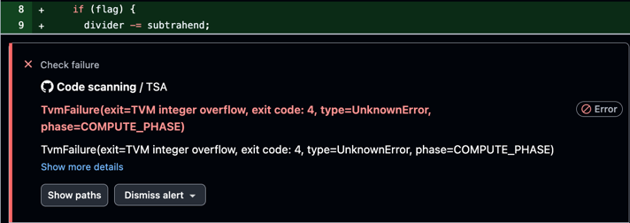

# Runtime errors detection mode

As a static analyzer, `TSA` can operate in two modes: 
- **Runtime error detection** for local smart contracts with report generation in [SARIF format](https://sarifweb.azurewebsites.net/);
- **Test generation** for [Blueprint](https://github.com/ton-org/blueprint) projects.

In runtime error detection mode, `TSA` accepts as input a contract file in one of the following formats: Tact or FunC source code, or Fift assembler code, or BoC (compiled code). Optionally, it also accepts a [TL-B scheme](https://docs.ton.org/v3/documentation/data-formats/tlb/tl-b-language) for the `recv_internal` method. For detailed input format information, use the `--help` argument.
The output in this mode is a SARIF report containing the following information about methods that may encounter a [TVM error](https://docs.ton.org/v3/documentation/tvm/tvm-exit-codes) during execution:

- `coverage` field in the report - instruction coverage percentage by the analyzer for the method
- `decoratedName` and `stmt` - the method id and instruction number where the error may occur, correspondingly
- `text` in a `message` - error code and its type
- `callFlows` - call stack at the moment of the error occurrence in the form (method id - instruction)
- `usedParameters` - possible (but not necessarily unique) parameters set causing the error
- `gasUsage` - approximate gas usage of the execution when the error occurred

For more information about error types, see the [Detectors page](../error-types).

---

## Examples

NOTE: the **original** Tact and FunC compilers do not preserve source code location information (source maps) in the resulting compiled code,
and the SARIF report generated by the tool will not be able to pinpoint errors directly in the source code.

The following examples will cover both cases: with source maps and with raw SARIF.

### Example with patched compilers via source maps

<details>
  <summary><b>Source-maps disclaimer</b></summary>

<br>
We use patched versions of the <a href="https://github.com/jefremof/tact/tree/tact-debug-info-bundled">Tact compiler</a>,  
<a href="https://github.com/jefremof/ton/tree/func-0.4.6-debug-info">FunC compiler</a>,  
and the <a href="https://github.com/jefremof/tsa/tree/pysical-locations">TSA analyzer</a>,<br>
to achieve full error mapping in the source code, as demonstrated in this pull request via <a href="https://github.com/jefremof/tsa-actions/pull/3">GitHub Actions</a>
</details>

Consider a simple smart contract written in Tact that may encounter an arithmetic overflow error when the `divide` method receives a value of `subtrahend` close to the minimal integer value:

```javascript
contract Divider {
  init() {}
  receive() {}

  get fun divide(subtrahend: Int, dividend: Int, flag: Bool): Int {
    let divider: Int = 42;
    if (flag) {
      divider -= subtrahend;
    } else {
      divider = 2;
    }

    if (dividend == 100) {
      throw(100);
    }

    return dividend / divider;
  }
}
```

Running the patched analyzer for this contract with patched Tact compiler with the following command (according to the [PR](https://github.com/jefremof/tsa-actions/pull/3)):


java -jar tsa-cli.jar \
tact -c "tact.config.json" -p "sample" -i "Divider" \
> Divider.sarif


produces a SARIF report that could be rendered in GitHub highlighting a possible error:



---

### Example with a raw SARIF

Consider a simple smart contract that may encounter a cell overflow error when the `write` method receives a value greater than 4:

```c
#include "stdlib.fc";

(builder) write(int loop_count) method_id {
    builder b = begin_cell();

    if (loop_count < 0) {
        return b;
    }
    
    ;; Ensure loop count is in range [-2^31;2^31] for the repeat loop
    loop_count = loop_count & 0x111111;
    var i = 0;
    repeat(loop_count) {
        builder value = begin_cell().store_int(i, 32);

        b = b.store_ref(value.end_cell());
    }

    return b;
}

() recv_internal(int msg_value, cell in_msg, slice in_msg_body) impure {
    ;; Do nothing
}
```

Running the analyzer for this contract with the following command 
(assuming the contract, FunC and Fift stdlibs are located in the current directory):


docker run --platform linux/amd64 -it --rm -v $PWD:/project ghcr.io/espritoxyz/tsa:latest func -i /project/example.fc \
--func-std /project/stdlib.fc \
--fift-std /project/fiftstdlib


(please note that FunC stdlib is pointed using the specific option `func-std`, not as a part of the input file) identifies the error in the raw SARIF report:

<details>
  <summary><b>Raw SARIF report</b></summary>
  <pre><code class="language-json">
{
    "$schema": "https://raw.githubusercontent.com/oasis-tcs/sarif-spec/master/Schemata/sarif-schema-2.1.0.json",
    "version": "2.1.0",
    "runs": [
        {
            "properties": {
                "coverage": {
                    "0": 100.0,
                    "75819": 100.0
                }
            },
            "results": [
                {
                    "codeFlows": [
                        {
                            "threadFlows": [
                                {
                                    "locations": [
                                        {
                                            "location": {
                                                "logicalLocations": [
                                                    {
                                                        "fullyQualifiedName": "Lambda",
                                                        "properties": {
                                                            "stmt": "STREF#5"
                                                        }
                                                    }
                                                ]
                                            }
                                        }
                                    ]
                                },
                                {
                                    "locations": [
                                        {
                                            "location": {
                                                "logicalLocations": [
                                                    {
                                                        "fullyQualifiedName": "Lambda",
                                                        "properties": {
                                                            "stmt": "artificial_jmp_to_TvmOrdContinuation(stmt=TvmStackBasicPushInst(location=Lambda:#0, i=0), savelist=TvmRegisterSavelist(c0=null, c1=null, c2=null, c3=null, c4=null, c5=null, c7=null))#1"
                                                        }
                                                    }
                                                ]
                                            }
                                        }
                                    ]
                                },
                                {
                                    "locations": [
                                        {
                                            "location": {
                                                "logicalLocations": [
                                                    {
                                                        "fullyQualifiedName": "Lambda",
                                                        "properties": {
                                                            "stmt": "implicit RET#7"
                                                        }
                                                    }
                                                ]
                                            }
                                        }
                                    ]
                                },
                                {
                                    "locations": [
                                        {
                                            "location": {
                                                "logicalLocations": [
                                                    {
                                                        "fullyQualifiedName": "Lambda",
                                                        "properties": {
                                                            "stmt": "artificial_jmp_to_TvmOrdContinuation(stmt=TvmStackBasicPushInst(location=Lambda:#0, i=0), savelist=TvmRegisterSavelist(c0=null, c1=null, c2=null, c3=null, c4=null, c5=null, c7=null))#1"
                                                        }
                                                    }
                                                ]
                                            }
                                        }
                                    ]
                                },
                                {
                                    "locations": [
                                        {
                                            "location": {
                                                "logicalLocations": [
                                                    {
                                                        "fullyQualifiedName": "Lambda",
                                                        "properties": {
                                                            "stmt": "implicit RET#7"
                                                        }
                                                    }
                                                ]
                                            }
                                        }
                                    ]
                                },
                                {
                                    "locations": [
                                        {
                                            "location": {
                                                "logicalLocations": [
                                                    {
                                                        "fullyQualifiedName": "Lambda",
                                                        "properties": {
                                                            "stmt": "artificial_jmp_to_TvmOrdContinuation(stmt=TvmStackBasicPushInst(location=Lambda:#0, i=0), savelist=TvmRegisterSavelist(c0=null, c1=null, c2=null, c3=null, c4=null, c5=null, c7=null))#1"
                                                        }
                                                    }
                                                ]
                                            }
                                        }
                                    ]
                                },
                                {
                                    "locations": [
                                        {
                                            "location": {
                                                "logicalLocations": [
                                                    {
                                                        "fullyQualifiedName": "Lambda",
                                                        "properties": {
                                                            "stmt": "implicit RET#7"
                                                        }
                                                    }
                                                ]
                                            }
                                        }
                                    ]
                                },
                                {
                                    "locations": [
                                        {
                                            "location": {
                                                "logicalLocations": [
                                                    {
                                                        "fullyQualifiedName": "Lambda",
                                                        "properties": {
                                                            "stmt": "artificial_jmp_to_TvmOrdContinuation(stmt=TvmStackBasicPushInst(location=Lambda:#0, i=0), savelist=TvmRegisterSavelist(c0=null, c1=null, c2=null, c3=null, c4=null, c5=null, c7=null))#1"
                                                        }
                                                    }
                                                ]
                                            }
                                        }
                                    ]
                                },
                                {
                                    "locations": [
                                        {
                                            "location": {
                                                "logicalLocations": [
                                                    {
                                                        "fullyQualifiedName": "Lambda",
                                                        "properties": {
                                                            "stmt": "implicit RET#7"
                                                        }
                                                    }
                                                ]
                                            }
                                        }
                                    ]
                                },
                                {
                                    "locations": [
                                        {
                                            "location": {
                                                "logicalLocations": [
                                                    {
                                                        "fullyQualifiedName": "Lambda",
                                                        "properties": {
                                                            "stmt": "artificial_jmp_to_TvmOrdContinuation(stmt=TvmStackBasicPushInst(location=Lambda:#0, i=0), savelist=TvmRegisterSavelist(c0=null, c1=null, c2=null, c3=null, c4=null, c5=null, c7=null))#1"
                                                        }
                                                    }
                                                ]
                                            }
                                        }
                                    ]
                                },
                                {
                                    "locations": [
                                        {
                                            "location": {
                                                "logicalLocations": [
                                                    {
                                                        "decoratedName": "75819",
                                                        "properties": {
                                                            "stmt": "REPEAT#11"
                                                        }
                                                    }
                                                ]
                                            }
                                        }
                                    ]
                                }
                            ]
                        }
                    ],
                    "level": "error",
                    "locations": [
                        {
                            "logicalLocations": [
                                {
                                    "decoratedName": "75819"
                                }
                            ]
                        }
                    ],
                    "message": {
                        "text": "TvmFailure(exit=TVM cell overflow, exit code: 8, type=UnknownError)"
                    },
                    "properties": {
                        "gasUsage": 3451,
                        "usedParameters": [
                            "2097151"
                        ],
                        "resultStack": [
                            "0"
                        ]
                    },
                    "ruleId": "cell-overflow"
                }
            ],
            "tool": {
                "driver": {
                    "name": "TSA",
                    "organization": "Explyt"
                }
            }
        }
    ]
}
  </code></pre>
</details>

Here the analyzed method has the id `75819`, 
the analyzer covered 100% instructions of this method,
and the `cell overflow` error with exit code `8` occurred in the stmt with the index `11` in the `REPEAT` loop inside this method,
`2097151` value passed to this method causes this error,
and gas usage equals to `3451`.

For more examples containing erroneous places, take a look at the directory in [the repository with manually written contracts](https://github.com/espritoxyz/tsa/tree/master/tsa-test/src/test/resources).