# Part 1: Getting a taste of TSA 

Welcome to this multi-part tutorial on using TSA for verifying TON smart contracts! In this Part 1 we will demonstrate the basic features of TSA in order to hack a live contract in the TON blockchain! 

More specifically, we will use TSA to reveal secret information stored in the contract's state and use this information to hack the contract. This simple task will allow us to explore basic features of TSA. In later parts of this multi-part tutorial, we will explore advanced features of TSA.

But before we start with the fun, we need to have an overview of what is TSA, what we can do with it and how to set it up in our computer. After we explain all that context, we will describe the specific problem we are going to solve, and then provide two ways of solving it: manually, by inspecting the contract's binary data; and automatically, by feeding the binary code and data to TSA. 

The reasons for trying the problem manually are twofold: first, it will give us insight on how contracts are stored in the TON blockchain, and second, it will prepare us with basic concepts that will be needed when exploring more advanced features of TSA in later parts of this tutorial series.

Let's go!

## 1. Pre-requisites

To properly understand this tutorial, you need to have some background on concepts related to the TON blockchain. Make sure you understand the concepts described in the following list:

- What is the TON blockchain and smart contracts.
- What are the MainNet and TestNet.
- How contracts are deployed.
- How a contract [address](https://docs.ton.org/v3/documentation/smart-contracts/addresses/address) is determined by its code and initial data.
- What are cells, and a very high-level view of the [Bag of Cells (BoC)](https://docs.ton.org/v3/documentation/data-formats/tlb/cell-boc/) format.
- How to setup a wallet in the TestNet and how to load Toncoins into the wallet.
- How internal messages are built and sent. Also, properties about internal messages, like message value, source and target addresses, message body (or payload).
- Basic familiarity with Javascript, [Tact](https://docs.tact-lang.org/), and [FunC](https://docs.ton.org/v3/documentation/smart-contracts/func/overview) programming languages.

## 2. What is TSA?

[TSA](https://github.com/espritoxyz/tsa) (acronym for: TON Symbolic Analyzer) is a static analysis tool based on symbolic execution and designed for smart contracts on the TON blockchain. The following is a quote from the TSA use cases [page](https://tonan.tech/modes/use-cases.html):

> The primary purpose of TSA is to enhance the reliability of the TON blockchain and its smart contracts. To achieve this goal, TSA can analyze trustworthy contracts in an automated mode (without user involvement) to identify errors, or in a semi-automated mode (with user-defined custom checkers) to check smart contracts for vulnerabilities and reliability.

TSA can analyze contracts in TVM bitcode. As a consequence, TSA is able to analyze contracts written in languages that compile down to TVM bitcode: low-level languages like Fift, middle-level languages like FunC, and high-level languages like Tact and Tolk. Depending on the objective, TSA can execute in several modes:

- Error detection mode. Useful for detecting arithmetic errors like integer overflows; serialization errors like cell overflows and underflows; and many more errors involving reading from slices and dictionaries. 
- Test generation mode. Useful for automatically generating tests from detected failing executions.
- Custom checker mode. This mode provides the greatest flexibility, since it allows users to define their own error detection logic. This mode is also very useful for checking if a specific property holds in a contract.

In this tutorial we will use the custom checker mode, since our objective will be to verify if, under some constraints, our custom assertion holds in our target contract. The other two modes are beyond the scope of this tutorial, but interested readers can learn about the other two modes in the TSA [use cases](https://tonan.tech/modes/use-cases.html) page.

## 3. Setting up TSA and libraries

The tutorial assumes you have a Linux-based operating system. For concreteness, we will work on Ubuntu 22.04.5 LTS (64 bits), but there shouldn't be much difference for other Linux distributions.

We will use a Docker image that is already preloaded with [Java JRE](https://www.java.com/en/download/manual.jsp), the [FunC](https://docs.ton.org/v3/documentation/smart-contracts/func/overview) and [Tact](https://tact-lang.org/) compilers, [Node.js](https://nodejs.org/en), and [TSA](https://esprito.com/tsa/), because this avoids the need to install all the dependencies manually. Follow these steps to setup the Docker image:

1. Follow the instructions for installing the [Docker Engine](https://docs.docker.com/engine/install/).

2. Open a terminal, and pull the TSA Docker image:

    ```
    sudo docker pull ghcr.io/espritoxyz/tsa:latest
    ```
    
    Wait until the image downloads. The image size is around 1.37 GB.

3. Run the Docker image:

    ```
    sudo docker run --entrypoint bash --workdir /home -it ghcr.io/espritoxyz/tsa
    ```

    This creates a Docker container and mounts the Docker image in the container. From here onwards, all commands executed in the terminal will execute in the created Docker container. The current container's working directory is `/home`.

    > IMPORTANT: We will refer to the terminal where the container is running as the "Docker terminal".

4. In the Docker terminal, create the directory `tutorial-1` inside `/home` and change to the newly created directory:

    ```
    mkdir tutorial-1
    cd tutorial-1
    ```

    `tutorial-1` is the directory where we will create all files in this tutorial.

5. In the Docker terminal, install the [@ton/core](https://www.npmjs.com/package/@ton/core) npm package:

    ```
    npm install @ton/core
    ```

6. (OPTIONAL step) It is recommended to install a command line text editor, since the Docker container does not have graphical editors. A recommended one is the `nano` text editor. Run the following in the Docker terminal to install `nano`:

    ```
    apt update
    apt install nano
    ```

## 4. The problem to solve

We will solve the [PEEK](https://www.hacktheton.com/en/level/peek) challenge in [Hack the TON](https://www.hacktheton.com/en). The PEEK challenge consists of a contract that is initially locked with a secret password. To solve the challenge, we need to unlock the contract by sending to it an `Unlock` message with the correct password.

A simplified version of the contract's source code is reproduced here for convenience (we removed the `"check"` string receiver, since it will not be used in this tutorial). The code is written in the [Tact](https://tact-lang.org/) programming language:

```tact
import "@stdlib/deploy";

message Unlock {
  password: Int as uint32;
}

contract PeekLevel with Deployable {
  player: Address;
  nonce: Int;
  password: Int as uint32;
  locked: Bool = true;

  init(player: Address, nonce: Int, password: Int){
    self.player = player;
    self.nonce = nonce;
    self.password = password;
  }

  receive(msg: Unlock) {
    require(msg.password == self.password, "Wrong password.");
    self.locked = false;
  }

  get fun locked(): Bool {
    return self.locked;
  }
}
```

The contract `PeekLevel` declares four fields that serve as its state:

```tact
player: Address;
nonce: Int;
password: Int as uint32;
locked: Bool = true;
```
where `player` is the address of the contract that is trying to solve the challenge; `nonce` serves as the unique identifier for the contract's instance (i.e., a single player can have several instantiated `PeekLevel` contracts, each one with a different `nonce` value); `password` is the secret password we must find; and `locked` is the current locked state of the contract, which initially is `true`.

Whenever a new instance of contract `PeekLevel` is deployed in the TON testnet, the `init` method executes and loads the `player`, `nonce` and `password` fields with some values unknown to us at the moment of deployment:

```tact
init(player: Address, nonce: Int, password: Int){
    self.player = player;
    self.nonce = nonce;
    self.password = password;
}
```

Our task is then to build an `Unlock` message:

```tact
message Unlock {
  password: Int as uint32;
}
```
containing the guessed password, and send it to the `PeekLevel` contract.

Once the message arrives to the contract, the receiver for `Unlock` messages executes:

```tact
receive(msg: Unlock) {
    require(msg.password == self.password, "Wrong password.");
    self.locked = false;
}
```

If we guessed the password correctly, the `require(msg.password == self.password, "Wrong password.")` will **not** throw an exception, because the password in the `Unlock` message `msg.password` coincides with the password stored in the contract field `self.password`. After the successful check, the `locked` field will change to `false`, which solves the challenge.

However, if we did not guess the password correctly, the `require(msg.password == self.password, "Wrong password.")` will throw an exception, interrupting the receiver's execution. As a consequence, the `locked` field remains in the `true` state.

The difficulty resides on how to find the secret password. The hint is: the secret password is stored in the contract's field `password`, which means that we should be able to find the password by inspecting the contract's state in the blockchain. 

Now that we understand the problem to solve, let us create a fresh instance of the `PeekLevel` contract. Follow these steps to create a new instance:

1. In the webpage for the [PEEK](https://www.hacktheton.com/en/level/peek) challenge, connect your testnet wallet by clicking on the yellow button "CONNECT WALLET". The webpage will prompt you to select the wallet and confirm the transaction. 

    Once we have a connected wallet, we can request the webpage to create a fresh instance of the `PeekLevel` contract. This contract will be initialized and deployed in the TON testnet. 

2. Click on the yellow button "GET NEW INSTANCE". Your wallet will ask to confirm the transaction. Confirm it. After a couple of seconds, the webpage console will reply with a message like this (bear in mind that the address you will get is different):

    ```
    The level instance is available at EQBG3BtJ0xFGU1YlUwKvrywElJVasna8xz68lc5wrl3t1k5q address.
    ```

Keep at hand the address you obtained, since we will use it in the next section.

We can now interact with the contract. Let us hack it!

## 5. Solving the problem

### 5.1. Solution 1: Manually discover the password

As a first solution, we will discover the password by manually inspecting the contract's state stored in the blockchain.

Our contract is active in the TON testnet. TON has available blockchain explorers that we can use to inspect contracts in the blockchain. In this tutorial we will use the [tonviewer explorer for the testnet](https://testnet.tonviewer.com/). 

Follow these steps to find the password:

1. In the search bar, input the contract address you obtained in the previous section, and click ENTER:

    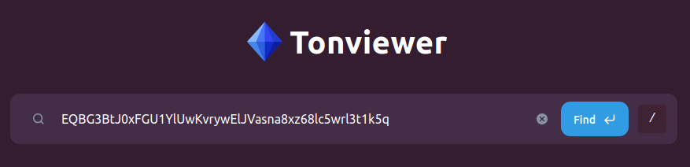

    Tonviewer will show details about our contract, distributed among several tabs: 

    - A history of received and sent messages (`History` tab),
    - Executed transactions (`Raw Transactions` tab),
    - The binary code and data (`Code` tab),
    - An interface for invoking contract's methods, also known as getters (`Methods` tab),
    - An interface for sending messages to the contract (`Send Message` tab).
    
    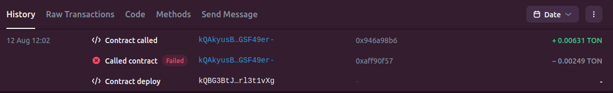

    We are interested in the contract's data, since this is where the contract stores its state.

2. Click on the `Code` tab, then on `Raw data`.

    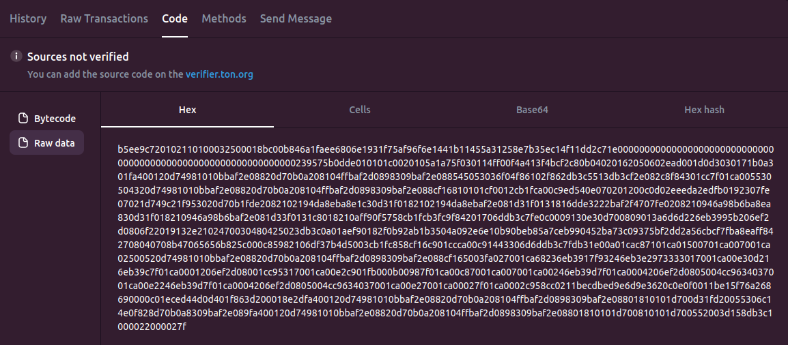

    The blockchain stores the contract's state (i.e., the raw data) in the BoC format. Tonviewer prints the BoC data in several equivalent representations: hexadecimal (Hex), Cells, and Base64. 

    Our task will be to examine the BoC in, say, the Hex representation, and extract the password.

3. Copy the Hex string. 

4. In the Docker terminal, in folder `/home/tutorial-1`, create a Javascript file named `read_boc.js`:
   
    ```
    nano read_boc.js
    ```

    Paste the following code inside `read_boc.js` and save it. The code parses the Hex string of step 3 into a string of bits that we can examine:

    ```javascript
    const { Cell } = require("@ton/core");

    // The argument to Cell.fromHex is the Hex string copied from step 3.
    // REPLACE THE STRING WITH THE ONE YOU OBTAINED IN STEP 3.
    // Cell.fromHex parses the BoC format and builds a cell containing the contract state.
    const cell = Cell.fromHex("b5ee9c720102110100032500018bc00b846a1faee6806e1931f75af96f6e1441b11455a31258e7b35ec14f11dd2c71e00000000000000000000000000000000000000000000000000000000000000239575b0dde010101c0020105a1a75f030114ff00f4a413f4bcf2c80b04020162050602ead001d0d3030171b0a301fa400120d74981010bbaf2e08820d70b0a208104ffbaf2d0898309baf2e088545053036f04f86102f862db3c5513db3cf2e082c8f84301cc7f01ca005530504320d74981010bbaf2e08820d70b0a208104ffbaf2d0898309baf2e088cf16810101cf0012cb1fca00c9ed540e070201200c0d02eeeda2edfb0192307fe07021d749c21f953020d70b1fde2082102194da8eba8e1c30d31f0182102194da8ebaf2e081d31f0131816dde3222baf2f4707fe0208210946a98b6ba8ea830d31f018210946a98b6baf2e081d33f0131c8018210aff90f5758cb1fcb3fc9f84201706ddb3c7fe0c0009130e30d700809013a6d6d226eb3995b206ef2d0806f22019132e2102470030480425023db3c0a01aef90182f0b92ab1b3504a092e6e10b90beb85a7ceb990452ba73c09375bf2dd2a56cbcf7fba8eaff842708040708b47065656b825c000c85982106df37b4d5003cb1fc858cf16c901ccca00c91443306d6ddb3c7fdb31e00a01cac87101ca01500701ca007001ca02500520d74981010bbaf2e08820d70b0a208104ffbaf2d0898309baf2e088cf165003fa027001ca68236eb3917f93246eb3e2973333017001ca00e30d216eb39c7f01ca0001206ef2d08001cc95317001ca00e2c901fb000b00987f01ca00c87001ca007001ca00246eb39d7f01ca0004206ef2d0805004cc9634037001ca00e2246eb39d7f01ca0004206ef2d0805004cc9634037001ca00e27001ca00027f01ca0002c958cc0211becdbed9e6d9e3620c0e0f0011be15f76a268690000c01eced44d0d401f863d200018e2dfa400120d74981010bbaf2e08820d70b0a208104ffbaf2d0898309baf2e08801810101d700d31fd20055306c14e0f828d70b0a8309baf2e089fa400120d74981010bbaf2e08820d70b0a208104ffbaf2d0898309baf2e08801810101d700810101d700552003d158db3c1000022000027f");
    // Extract the bits in the cell as a BitString object.
    const data = cell.bits;
    // Transform the BitString object into an array of booleans. Each boolean represents a bit.
    const bitsBool = [];
    for (let i = 0; i < data.length; i++) {
        bitsBool.push(data.at(i));
    }
    // Transform the array of booleans into a string, 1 for "true", 0 for "false".
    const bitString = bitsBool.map(bit => bit ? "1" : "0").join("");
    // Print the string of bits in the console.
    console.log(bitString);
    ```

5. Run the code:

    ```
    node read_boc.js
    ```

    The console should print a string of bits. The following figure shows the string of bits, but color-coded so that we see the interpretation of the bits in the string.

    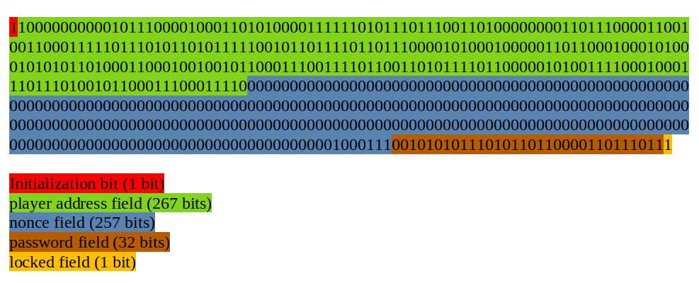

    Let us explain how we arrive to such interpretation of the bits. Bear in mind that the bits you obtained for your particular contract may be different; however, the *bit lengths* of each field must be the same.

    Let us start with the **Initialization bit**. Every contract written in Tact stores an initialization bit as the first data in the contract state. If the bit is `1` it means that the contract's `init` method has been executed; the bit is set to `0` otherwise.

    In our example, the initialization bit is `1`. This means that the `init` method executed and set a value to the `player`, `nonce`, and `password` fields. These values, which are currently unknown to us, were passed as parameters to the `init` method during the contract deployment:
        
    ```tact
    init(player: Address, nonce: Int, password: Int) {
        self.player = player;
        self.nonce = nonce;
        self.password = password;
    }
    ```

    Additionally, the `1` in the initialization bit also indicates that all contract fields with initialization expressions are now set. For example, the `locked` field is now set to `true`:

    ```tact
    player: Address;
    nonce: Int;
    password: Int as uint32;
    locked: Bool = true;  // The locked field is now set to true
    ```
    
    Hence, after contract deployment, we know that the `player`, `nonce`, and `password` fields have some value, and the `locked` field is `true`. What are the values stored in `player`, `nonce` and `password`? Let us find out.

    Immediately after the initialization bit, contracts written in Tact reserve a certain amount of bits in the contract state for each of the declared fields. The bits are reserved in the same order in which the fields are declared. For example, the `player` field should occur first in the contract state, followed by `nonce`, then `password`, and finally `locked`, since this is the order in which the fields are declared in the contract source code.

    A field of type `Address` will reserve `267` bits. A field of type `Int`, `257` bits. A field of type `Int as uint32`, `32` bits. And a field of type `Bool`, `1 bit`. This explains the interpretation of the color-coded string of bits shown in the previous image.

    From the color-coded string of bits, we conclude that the `password` field must have the value `00101010111010110110000110111011`, which is `720069051` as a decimal number.

We know the secret password. This means we can try to unlock the contract now. To do this, we need to send an `Unlock` message to the contract, containing the password we just found.

In other words, we need to send a message containing the data described in the declaration:

```tact
message Unlock {
  password: Int as uint32;
}
```

We can use the tonviewer explorer to send the message. However, tonviewer expects a manually constructed message payload (also known as the message body). For that matter, we need to understand the required format of the message payload: the first 32 bits of the payload need to be an unsigned integer known as **opcode**. The opcode tells the receiving contract the kind of message, and therefore, tells the contract how to parse the rest of the payload. 

For example, if the first 32 bits are the opcode for the `Unlock` message, the contract expects that, after the opcode, the next 32 bits contain an unsigned integer representing the password, as the `message` declaration for `Unlock` suggests:

```tact
message Unlock {
  password: Int as uint32;
}
```

How do we find the opcode for the `Unlock` message? The Tact compiler assigns an opcode to each `message` declaration. If the opcode is not explicitly stated in a `message` declaration, the Tact compiler will assign some opcode to such declaration. This means that we actually do not know the opcode corresponding to an `Unlock` message, because the source code did not explicitly declared it, like in:

```tact
message(3868) Unlock {
  password: Int as uint32;
}
```
where the opcode is `3868`.

This implies that if we want to manually find the opcode assigned by the Tact compiler to the `Unlock` message declaration, the only way is by inspecting the contract's decompiled bitcode. This is a tedious and complex task that requires having low-level knowledge of the instructions in the TON Virtual Machine.

> SIDE NOTE: The Tact compiler produces a [compilation report](https://docs.tact-lang.org/book/compile/#report). In the report, each message declaration is shown its generated opcode. The difficulty we have in our situation is that we were given an already compiled contract and we do not have access to the compilation report. Nevertheless, one possible way to discover the opcode would be to take the source code of the PeekLevel contract and manually compile it. Then, look into the compilation report. However, proceeding this way is not recommended, because there is a risk (though very low) that the opcodes of the manually compiled and the already compiled contracts will not match, because it depends on the Tact compiler version used.

Instead of attempting to find the opcode manually, we will switch to a solution involving the use of TSA. It turns out that we can use TSA not only to find the password, but **also** the message's opcode.

### 5.2 Solution 2: Automatically discover the password using TSA

The custom checker mode of TSA basically works like a constraint solver. Given the contract code and some constraints provided by the user, TSA generates further constraints from the code, and tries to find values to all variables provided by the user so that all the constraints are satisfied. 

In other words, we can use TSA as an "example finder" or "instance finder". In our case, the "example" we want TSA to find is the message that would change the state of the contract from locked to unlocked, or more specifically, the message that would change the state of the contract's `locked` field from `true` to `false`.

#### 5.2.1 Preparing the project

We will work entirely in the Docker terminal. In `/home/tutorial-1`, carry out the following steps to setup the TSA project:

1. Create an `/imports` directory.

    ```
    mkdir imports
    ```

    The `imports` folder will have libraries and files required for compilation and interaction with TSA from FunC.

2. Copy the TSA jar file into the project:

    ```
    cp ../tsa.jar .
    ```

    The `tsa.jar` file is the TSA executable.

3. Copy the FunC standard library into the `imports` directory:

    ```
    cd imports
    cp /usr/share/ton/smartcont/stdlib.fc .
    ```

4. Copy the Fift library into the `imports` directory:

    ```
    mkdir lib
    cp -r /usr/lib/fift/. ./lib
    ```

    This library is required for compiling into TVM bitcode.

5. Download the [FunC-TSA interface file](https://github.com/espritoxyz/tsa/blob/master/tsa-test/src/test/resources/imports/tsa_functions.fc) into `/imports`. We will need this file to talk to TSA from FunC code.

    ```
    curl -O https://raw.githubusercontent.com/espritoxyz/tsa/refs/heads/master/tsa-test/src/test/resources/imports/tsa_functions.fc
    ```
    
Next, we need to download the contract's bitcode and the contract's data into our TSA project. We use tonviewer for this task. Follow these steps:

1. Go to [tonviewer for the testnet](https://testnet.tonviewer.com/). Input the contract's address in the search bar, and press ENTER.

2. Click on the `Code` tab, then on the `Bytecode` option on the left hand side. Ensure the `Hex` representation is chosen and copy the Hex string:

    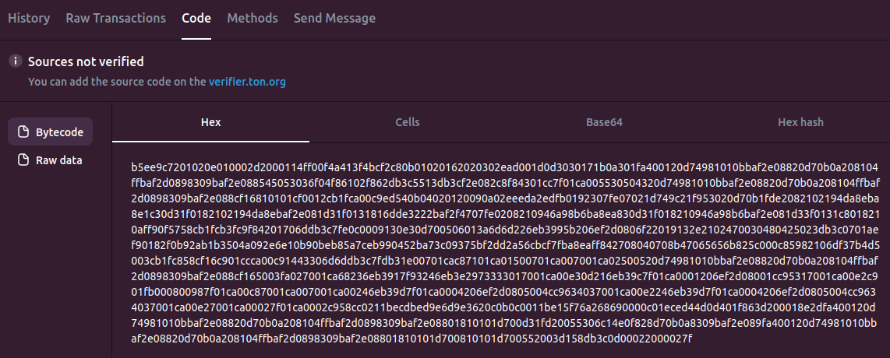

3. In folder `/home/tutorial-1`, create a Javascript file named `save_boc.js`:
   
    ```
    nano save_boc.js
    ```

    Paste the following code inside `save_boc.js` and save it. This script transforms into binary the Hex string copied in the previous step and dumps the bytes into a file.
    
    ```javascript
    const fs = require("fs");

    // This is the Hex string copied in step 2.
    // REPLACE THE STRING WITH THE ONE YOU OBTAINED IN STEP 2.
    const hexString = "b5ee9c7201020e010002d2000114ff00f4a413f4bcf2c80b01020162020302ead001d0d3030171b0a301fa400120d74981010bbaf2e08820d70b0a208104ffbaf2d0898309baf2e088545053036f04f86102f862db3c5513db3cf2e082c8f84301cc7f01ca005530504320d74981010bbaf2e08820d70b0a208104ffbaf2d0898309baf2e088cf16810101cf0012cb1fca00c9ed540b04020120090a02eeeda2edfb0192307fe07021d749c21f953020d70b1fde2082102194da8eba8e1c30d31f0182102194da8ebaf2e081d31f0131816dde3222baf2f4707fe0208210946a98b6ba8ea830d31f018210946a98b6baf2e081d33f0131c8018210aff90f5758cb1fcb3fc9f84201706ddb3c7fe0c0009130e30d700506013a6d6d226eb3995b206ef2d0806f22019132e2102470030480425023db3c0701aef90182f0b92ab1b3504a092e6e10b90beb85a7ceb990452ba73c09375bf2dd2a56cbcf7fba8eaff842708040708b47065656b825c000c85982106df37b4d5003cb1fc858cf16c901ccca00c91443306d6ddb3c7fdb31e00701cac87101ca01500701ca007001ca02500520d74981010bbaf2e08820d70b0a208104ffbaf2d0898309baf2e088cf165003fa027001ca68236eb3917f93246eb3e2973333017001ca00e30d216eb39c7f01ca0001206ef2d08001cc95317001ca00e2c901fb000800987f01ca00c87001ca007001ca00246eb39d7f01ca0004206ef2d0805004cc9634037001ca00e2246eb39d7f01ca0004206ef2d0805004cc9634037001ca00e27001ca00027f01ca0002c958cc0211becdbed9e6d9e3620c0b0c0011be15f76a268690000c01eced44d0d401f863d200018e2dfa400120d74981010bbaf2e08820d70b0a208104ffbaf2d0898309baf2e08801810101d700d31fd20055306c14e0f828d70b0a8309baf2e089fa400120d74981010bbaf2e08820d70b0a208104ffbaf2d0898309baf2e08801810101d700810101d700552003d158db3c0d00022000027f";

    // Create the binary file at the root of the TSA project folder
    const filePath = "code.boc"; 

    // Convert hex string to raw bytes
    const buffer = Buffer.from(hexString, "hex");

    // Write buffer to file (overwrites if file exists)
    fs.writeFileSync(filePath, buffer);
    ```

    Run the script:

    ```
    node save_boc.js
    ```

4.  Next, repeat the steps for the contract's data. In more detail, inside tonviewer, select `Raw data` in the `Code` tab. Copy the `Hex` string. Paste the hex string in the script of the previous step and also change the `filePath` variable value to `"data.boc"`. Run the script.

So far, the contents of the TSA project `/home/tutorial-1` should look like the following:

```
/tutorial-1
|-- /imports
    |-- /lib
        |--- ... A bunch of Fift files
    |-- stdlib.fc
    |-- tsa_functions.fc
|-- read_boc.js
|-- save_boc.js
|-- tsa.jar
|-- code.boc
|-- data.boc
```

#### 5.2.2 Writing the constraints

The user-provided constraints are written in what TSA calls a *checker contract*. This contract is written in FunC and it must contain all the constraints and assertions that TSA must check. 

The general structure of the checker contract is as follows:

```c
#include "imports/stdlib.fc";
#include "imports/tsa_functions.fc";

() main() impure {
    ;; Here, we should write all needed constraints
}
```

We import `stdlib.fc` because we are going to use functions from the FunC Standard Library. Also, we import `tsa_functions.fc` since we will invoke functions that communicate with TSA. 

TSA will attempt to execute the `main` method, so that **any** failure during the execution of `main` will cause TSA to stop and report the values and inputs leading to the failure. If there are no failures, TSA will issue an empty report. 

In other words (and this is important), **TSA finds an example only if it leads to failures during the execution of `main`**. This means that we should encode the assertion we want to check as if it was a failure; for example, by throwing an exception if the assertion holds. 

To illustrate the previous paragraph, let us suppose that we want TSA to find an integer bigger than `7`. The following checker contract will find such integer and store it in variable `x`:

```c
#include "imports/stdlib.fc";
#include "imports/tsa_functions.fc";

() main() impure {
    ;; Create a symbolic integer variable storing a 16-bit unsigned integer. 
    ;; Store the found value in x.
    int x = tsa_mk_int(16, 0);

    ;; Show the value of x in the final report, under name 0
    tsa_fetch_value(x, 0);

    ;; Throw exception 256 if x is bigger than 7.
    throw_if(256, x > 7);
}
```

In the above code, function `tsa_mk_int` informs TSA to create a symbolic integer variable. The first argument of `tsa_mk_int` is the integer bit-length (in our example, a 16-bit integer). The second argument of `tsa_mk_int` indicates if the integer is signed (`-1`) or unsigned (`0`). Any instantiation of this symbolic variable will be stored in `x`.

Next, function `tsa_fetch_value` instructs TSA to show the value of `x` in the final report, in case TSA finds a suitable instance for `x`. The report will show the value of `x` under the name `"0"`. Currently, only integer names can be used to name variables in the report.

Finally, the code throws exception number `256` if the value of `x` is bigger than `7`. Think of TSA as trying several values for `x` until it finds one that causes exception number `256`. At the moment the exception happens, TSA stops and outputs a report that will include something like the following:

```
"fetchedValues": {
    "0": "8"
},
```
indicating that TSA found value `8` for the variable named `"0"`.

For a more mathematically inclined reader, the assertion that the above checker contract is encoding is:

> There is a 16-bit unsigned integer `x` such that `x > 7`.

The existential is implicitly handled by the function `tsa_mk_int`, because it creates a symbolic variable that TSA needs to fill with a concrete value. 

At this moment, do not worry about how to run TSA or how to interpret the output report, since we will explain those tasks later in the tutorial. What matters at this point is that the assertion to check should be encoded as a failure (as the previous example showed):

```c
() main() impure {
    
    ......

    throw_if(..., assertion_to_check);
}
```

What if the assertion to check has some set of complex pre-conditions, where each pre-condition could fail?

```c
() main() impure {
    
    ;; Each pre-condition could fail

    pre_condition_1

    pre_condition_2

    pre_condition_3

    .... etc

    throw_if(..., assertion_to_check);
}
```

In this case, the desired behavior is that the contract should fail only when all the pre-conditions successfully go through, and execution fails at the `throw_if`. In other words, **if all the preconditions successfully hold, then the final assertion should cause a failure**. However, the standard behavior of TSA is that it will stop at the first failure it encounters among the pre-conditions. How can we model the desired behavior?

Fortunately, TSA has a mechanism to model this precise situation. Just surround all your preconditions between the functions `tsa_forbid_failures` and `tsa_allow_failures`:

```c
() main() impure {
    
    ;; Signal TSA to ignore failures happening after this function. 
    ;; If a failure happens, TSA will try another instantiation,
    ;; so that only instantiations that successfully execute all
    ;; pre-conditions will reach the tsa_allow_failures function call below.
    tsa_forbid_failures();

    ;; Each pre-condition could fail

    pre_condition_1

    pre_condition_2

    pre_condition_3

    .... etc

    ;; Signal TSA to stop if a failure happens after this function.
    tsa_allow_failures();

    throw_if(..., assertion_to_check);
}
```

Function `tsa_forbid_failures` tells TSA to ignore any failures happening after the function call. If a failure happens after the call to `tsa_forbid_failures`, TSA will try a different instantiation of the symbolic variables until it finds an instantiation that successfully reaches the call to `tsa_allow_failures`, which activates again the normal behavior of TSA: stop at any failure. So that when TSA reaches `throw_if(..., assertion_to_check)`, if `assertion_to_check` turns out to be true, `throw_if` will throw the exception and TSA will issue a report with the instantiations to the symbolic variables found so far.

With the above explanation, we are ready to write the checker contract. The assertion we want to check is:

> There is a message `m` such that: we can successfully send `m` to the PeekLevel contract, AND immediately afterwards we can successfully invoke the `locked` getter to obtain the value of the `locked` field, AND the `locked` field's value is `false`.

In `/home/tutorial-1`, create a file named `checker.fc`. Paste the following code and save it. This checker contract encodes the above assertion. The explanation of how this is accomplished is given after the code:

```c
#include "imports/stdlib.fc";
#include "imports/tsa_functions.fc";

() locked() method_id { }

int id_locked() asm "locked PUSHINT";

() main() impure {

    tsa_forbid_failures();
        
    ;; Send a message to the PeekLevel contract (identified with index 1).
    ;; Show the message in the final report under name "0".
    tsa_send_internal_message(1, 0);

    ;; Call the locked getter in the PeekLevel contract.
    ;; The result is the value of the locked field.
    ;; Store the result in locked_val.
    int locked_val = tsa_call_1_0(1, id_locked());
            
    tsa_allow_failures();
    
    ;; Stop if locked_val is false
    throw_if(256, locked_val == 0);
}
```

The assertion states that the value of the `locked` field should be `false` AFTER we have successfully sent the message and invoked the contract's `locked` getter. Therefore, the actions for sending the message and invoking the getter should be enclosed by the functions `tsa_forbid_failures` and `tsa_allow_failures`, since we are only interested in messages for which those two actions successfully execute.

Function `tsa_send_internal_message(contract_id, message_id)` instructs TSA to send a message to the contract identified by `contract_id`. Additionally, the function creates a symbolic variable representing the message to be sent, and includes the instantiated message in the final report under name `message_id`.

TSA always assigns the contract identifier `0` to the checker contract, and identifier `1` to the contract we are verifying (in our case, the PeekLevel contract). We will say more on how TSA assigns contract identifiers in Section [5.2.3](#523-running-tsa-from-the-command-line), but this is enough for our current purposes.

Returning to the discussion on the `tsa_send_internal_message` function, in our checker contract we have `tsa_send_internal_message(1, 0)`. This means that TSA will send a message to the contract with identifier `1` (i.e., the PeekLevel contract), it will create a symbolic variable representing the message, and show the contents of the message in the final report under name `"0"`.

Function `tsa_call_1_0(contract_id, method_id)` invokes the method (or getter) with id `method_id` of contract with id `contract_id` and produces a single value as output. In our example, `tsa_call_1_0(1, id_locked())` will invoke in contract `1` (the PeekLevel contract), the getter with id returned by function `id_locked()` (i.e., the id of the `locked` getter), and the result is stored in the `locked_val` variable for later reference.

There are a couple of points to discuss about the call `tsa_call_1_0(1, id_locked())`. First, What is the meaning of the suffix `_1_0` in the name of the function `tsa_call_1_0`? Second, How does the `id_locked` function compute the id of the `locked` getter?

The answer to the first question is that TSA has several function names of the form `tsa_call_n_m`, where `n` and `m` are numbers. Number `n` indicates the number of results expected in the getter call, and `m` the number of arguments to pass to the getter. For example, `tsa_call_2_3(arg_1, arg_2, arg_3, contract_id, method_id)` means that we expect that `method_id` returns `2` values when calling it with the `3` arguments `arg1, arg2, arg3`. Note that the arguments `contract_id` and `method_id` are not included in the count for number `m` and these two arguments must always be placed at the end of each `tsa_call_n_m` function call.

The answer to the second question is: by an indirect technique that takes advantage on how getter ids are computed by the compiler. We explain next how this indirect technique works. 

The getter id can only be obtained by using an indirect technique because the source code did not declare an explicit id for the `locked` getter, like this:

```tact
get(3455) fun locked(): Bool {
    return self.locked;
}
```
where `3455` is the getter id. 

When no id is explicitly declared, the Tact compiler computes a getter id according to the formula:

```tact
(crc16(<getter_name>) & 0xffff) | 0x10000
```
as explained in the [Tact language documentation](https://docs.tact-lang.org/book/functions/#method-ids). 

The FunC compiler also uses the above formula for computing ids for `method_id` declarations. Therefore, by making the empty declaration in the checker contract:

```c
() locked() method_id { }
``` 
we are telling the FunC compiler to compute an id for the name `locked`, which will coincide with the id of the getter in the PeekLevel contract, because they get computed with the same formula.

What remains is to write a function that returns the computed id for the name `locked`. This is achieved by the assembly function:

```c
int id_locked() asm "locked PUSHINT";
```

This function works because whenever the name `locked` occurs in assembly code, the compiler replaces the name `locked` for its computed id. Hence, `locked PUSHINT` places the id of `locked` at the top of the TVM stack, so that when function `id_locked` finishes execution, it pops this value and returns it.

> NOTE: If the `locked` getter declared an explicit id, say `get(88503) fun locked(): Bool`, then we would write `tsa_call_1_0(1, 88503)` in the checker contract, without the need to carry out the above indirect technique.

The final part left to explain from the checker contract is:

```c
throw_if(256, locked_val == 0);
```

But this is the statement "the value of the `locked` field is `false`" encoded as a failure, as required by the normal behavior of TSA.

In summary, the checker contract is telling TSA to try different messages until it finds one that:

- There is no error when the message is sent to the PeekLevel contract.
- There is no error when the `locked` getter is invoked afterwards. 
- The result of the `locked` getter is `false`.

#### 5.2.3 Running TSA from the command line

At `/home/tutorial-1` run the following command:

```
java -jar tsa.jar custom-checker --checker checker.fc --contract boc code.boc --data data.boc --fift-std imports/lib -o report.sarif
```

Let us explain each argument in the command:

- `java -jar tsa.jar custom-checker` executes TSA in custom checker mode.
- `--checker checker.fc` tells TSA to use the code in `checker.fc` as the checker contract. TSA will assign index `0` to the checker contract.
- `--contract boc code.boc` tells TSA to use the code in `code.boc` as the contract to verify. The `boc` option tells TSA that the contents in `code.boc` are in the BoC format (i.e., bitcode). 

    TSA also accepts source files written directly in Tact (with the `tact` option) and in FunC (with the `func` option). Further details for the `tact` and `func` options can be seen by executing the command `java -jar tsa.jar custom-checker --help`.

    TSA assigns indexes to contracts, starting from `1`, in the same order as they are declared with the `--contract` option. In our example, the contract in `code.boc` will have index `1`, since it is the first `--contract` declaration. If there were further `--contract` declarations, they would have indexes `2`, `3`, and so on. Such multi-contract situations occur when we want to verify how such group interacts, but multi-contract verification is outside the scope of this tutorial.
- `--data data.boc` tells TSA to use the data in `data.boc` as the initial contract state.
- `--fift-std imports/lib` tells TSA to use the Fift library `imports/lib` during compilation of the checker contract.
- `-o report.sarif` tells TSA to write the final report in `report.sarif`. The report will be a plaintext file containing the TSA findings.

#### 5.2.4 Interpreting the TSA output report

After TSA executes, you should see a `report.sarif` in `/home/tutorial-1`. Open it with nano:

```
nano report.sarif
```

The report consists on a list of `"results"`:

```
"results": [
    {
        // First result
    },
    {
        // Second result
    }
    ... etc
]
```

Each result consists on information about its kind and properties. In our case, the report consists on a single result. The result is an error, with details under the `"message"` entry:

```
"message": {
    "text": "TvmFailure(exit=TVM user defined error with exit code 256, phase=COMPUTE_PHASE)"
},
```
which means that TSA threw exception `256`, or equivalently, that TSA was able to confirm that the assertion is true.

The interesting info occurs under the entry `"properties"`, and specifically, under the sub-entry `"additionalInputs"`. Here, TSA shows the message that caused the error under the name `"0"` (recall that this is the name specified in the checker contract), together with some properties about this message, like its source address (`"srcAddress"`), its message body (`"msgBody"`), the amount of nanotons received in the message (`"msgValue"`), if it is a bounced message (`"bounced"`), etc.

We are interested in the message body (`"msgBody"`), since this is the message payload that unlocked the contract. The report shows that the message body is a cell, with its contents shown in the `"data"` entry. The following are the first 64 bits in the `"data"` entry:

```
0010000110010100110110101000111000101010111010110110000110111011
```

We only consider the first 64 bits, because we know that the payload for an `Unlock` message should consist on a 32-bit unsigned integer representing the opcode, followed by another 32-bit unsigned integer representing the password. Any extra bits will be irrelevant for the receiving contract. Recall that TSA just needs to find **one** message that works, and there is no constraint in the checker contract that restricts the message body length to be 64 bits. 

Therefore, reading the bits, the opcode must be `00100001100101001101101010001110`, or `563403406` as a decimal number; and the password should be `00101010111010110110000110111011`, or `720069051` as a decimal number. Note that this password coincides with the number we manually found in Section [5.1](#51-solution-1-manually-discover-the-password).

### 5.3 Finally, hack the contract!

In the previous section we discovered that the opcode we need to send is `563403406` and the password is `720069051`. We will use [tonviewer for the testnet](https://testnet.tonviewer.com/) to send the message. Follow these steps to finally unlock the contract:

1. In the tonviewer search bar, input the contract address and press ENTER. Then, go to tab `Send Message`.

    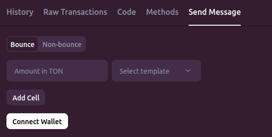

2. In order to send the message, we need to pay the cost for sending it. As such, we need to connect our testnet wallet to pay for the costs. Click on the button "Connect wallet". If the wallet was connected successfully, it will be indicated in the top right-corner in tonviewer (to the right of the search bar).
    
    

3. We can now fill the data for our message. Leave the default `Bounce` option selected. Enter the TON amount `0.5`. Then click on `Add cell`. This cell is the message body or payload. So far, the form should look as follows:

    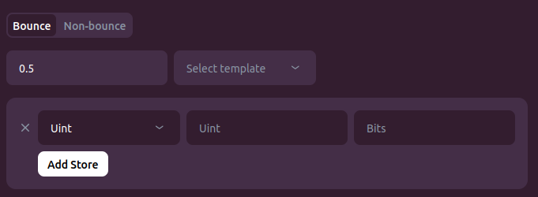

4. The first field in the message body should be the opcode. Select `Uint` (i.e., unsigned integer) from the drop down menu. On the first textfield type `563403406` (i.e., the opcode we found using TSA). In the second textfield type `32`, since the opcode should be a 32-bit unsigned integer. Finally, click on the button `Add Store` to add a second field to the message body, since we still need to add the password. The form should look as follows:

    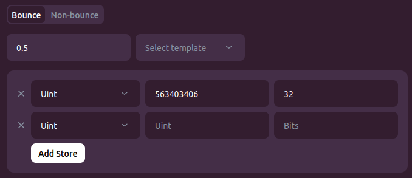

5. For the second field, select `Uint` from the drop down menu. On the first textfield type `720069051` (i.e., the password). In the second textfield type `32`, since the password should be a 32-bit unsigned integer. The form should look as follows:

    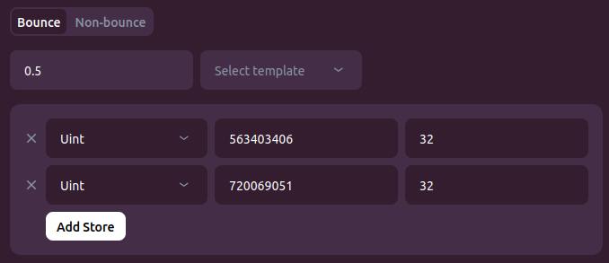

6. Click the `Send Message` button. Your wallet will ask you to confirm the transaction. After the transaction is confirmed by your wallet, wait a couple of seconds so that the contract receives the message and executes the unlocking logic.

7. Let us now confirm that the contract is indeed unlocked. Click on tab `Methods`.

    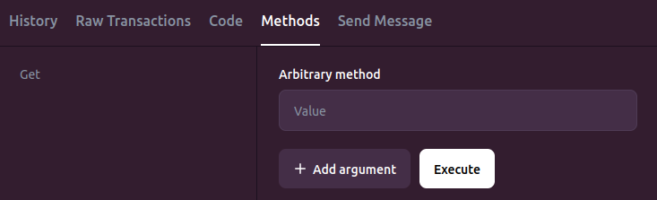

8. In the `Arbitrary method` textfield, type `locked`. This is telling tonviewer to invoke the `locked` getter. Click the `Execute` button. Tonviewer should show the following result:

    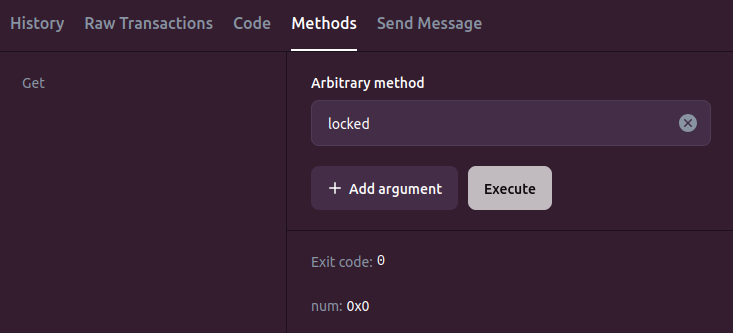

    The exit code `0` means that the getter executed successfully. `num: 0x0` means that the getter returned the number `0` (i.e., `false`). Here, `0x0` is simply the hexadecimal representation of `0`. 
    
    Therefore, the contract is now unlocked.

## 6. Closing thoughts

Congratulations! You have successfully hacked a contract by using TSA to inspect the contract state. Along the way, we learned:

- How to use tools to inspect info about contracts and interact with them, like tonviewer. 
- How to read contract fields from the bits in the contract state.
- How to use checker contracts in TSA to check properties about a target contract. 
- How to use basic functions in TSA to state properties and assertions in checker contracts.

In the next part, we will carry an audit on a contract by compiling the source code ourselves and use TSA to check assertions about the source code. Stay tuned!

